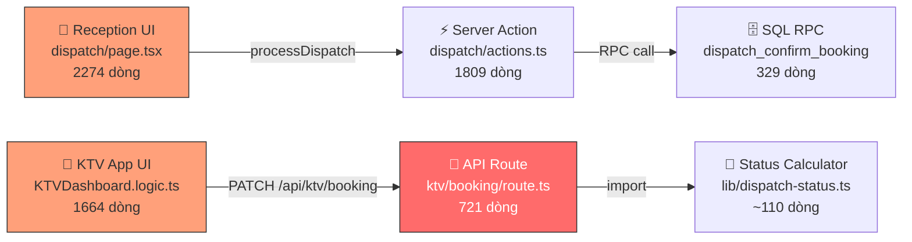

# 📊 Kế Hoạch Tách Luồng Điều Phối KTV (v2 — Updated)

> **Ngày tạo**: 16/05/2026  
> **Cập nhật**: 17/05/2026  
> **Mục đích**: Tách file `route.ts` thành action-based handlers, thêm comment bảo vệ, viết rule chống AI regression

> [!IMPORTANT]
> Bản v2 đã sửa: line ranges chính xác theo code 721 dòng, redesign `HandlerContext`/`HandlerResult`, clarify orchestrator responsibilities.

---

## 1. BẢN ĐỒ LUỒNG ĐIỀU PHỐI (6 File Liên Quan)



### Vai trò từng file:

| # | File | Dòng | Vai trò | Tần suất sửa | Rủi ro |
|:-:|------|:----:|---------|:---:|:---:|
| 1 | `dispatch/page.tsx` | 2274 | UI điều phối + handleDispatch | Cao | 🟡 |
| 2 | `dispatch/actions.ts` | 1809 | Server actions (processDispatch, saveDraft...) | Trung bình | 🟡 |
| 3 | `dispatch_confirm_booking` (SQL) | 329 | RPC xử lý transaction atomic | Thấp | 🟢 |
| 4 | **`ktv/booking/route.ts`** | **721** | **API xử lý START/FINISH/RELEASE** | **Rất cao** | **🔴** |
| 5 | `KTVDashboard.logic.ts` | 1664 | Hook toàn bộ logic KTV App | Cao | 🔴 |
| 6 | `lib/dispatch-status.ts` | ~110 | Tính toán booking status | Thấp | 🟢 |

---

## 2. PHÂN TÍCH `route.ts` — FILE CẦN TÁCH (721 dòng)

### Cấu trúc hiện tại (chính xác theo code):

```
route.ts (721 dòng)
├── L1-5:     Imports + dynamic config
├── L6-15:    getBusinessDate() — Shared utility
│
├── L21-437:  GET handler (fetch booking for KTV)
│   ├── L26-84:    Resolve bookingId (activeItems → TurnQueue → KtvAssignments)
│   ├── L86-107:   🔧 SYNC CHECK: Auto-activate assignment
│   ├── L109-201:  Fetch booking + enrich items with service data
│   ├── L203-263:  Resolve active item + segment index
│   ├── L265-279:  Fetch room procedures (prep/clean)
│   ├── L281-345:  🔄 On-the-fly timeline shift calculation
│   └── L351-433:  Fetch next booking info + response
│
└── L444-720: PATCH handler (update booking status)
    ├── L446-483:  Parse body + resolve KTV's item IDs  ← SHARED SETUP
    │
    ├── L485-587:  ⚡ START_TIMER / NEXT_SEGMENT block
    │   ├── L486-508:  Time validation (chờ đúng giờ, trả 403 nếu sớm)
    │   ├── L510-554:  Segment actualStartTime logic
    │   └── L556-587:  TurnQueue recalculation (estimated_end_time)
    │
    ├── L589-697:  ⚡ CLEANING / FEEDBACK / DONE block
    │   ├── L593-609:  Gom ALL segments cho KTV này (cross-item)
    │   ├── L611-650:  isMerged time allocation (phân bổ theo duration ratio)
    │   ├── L652-676:  🧠 Smart Status per-item (allSegsDone + alreadyRated)
    │   └── L678-697:  recomputeBookingStatus (booking-level)
    │
    ├── L699-706:  Booking update (apply updatePayload)
    │
    └── L708-711:  ⚡ RELEASE_KTV block (2 lệnh Supabase)
```

### 3 Block logic hoàn toàn độc lập:

| Block | Lines | Chức năng | Tự xử lý DB? |
|-------|:-----:|-----------|:---:|
| **START** | L485-587 | Bấm BẮT ĐẦU, set actualStartTime, recalc TurnQueue | ✅ BookingItems + TurnQueue |
| **FINISH** | L589-697 | Xong DV, phân bổ thời gian, Smart Status, recompute | ✅ BookingItems + Bookings |
| **RELEASE** | L708-711 | Giải phóng KTV khỏi đơn + promote next | ✅ KtvAssignments + RPC |

> [!NOTE]
> 3 block này dùng chung `allItemIdsForThisKTV`, `turnForSync`, `today` từ phần setup (L446-483).
> Logic bên trong **hoàn toàn không phụ thuộc nhau** — chỉ 1 block execute mỗi request.
> Tuy nhiên, mỗi handler **tự chịu trách nhiệm DB operations** thay vì chỉ trả payload.

---

## 3. KẾ HOẠCH TÁCH FILE

### Cấu trúc đề xuất:

```
app/api/ktv/booking/
├── route.ts                    ← Orchestrator (thin ~100 dòng)
├── _handlers/
│   ├── handleGetBooking.ts     ← GET logic (~420 dòng, chia private functions)
│   ├── handleStartTimer.ts     ← START_TIMER + NEXT_SEGMENT (~110 dòng)
│   ├── handleFinishService.ts  ← CLEANING / FEEDBACK / DONE (~120 dòng)
│   └── handleReleaseKTV.ts     ← RELEASE_KTV (~25 dòng, extensible)
└── _shared/
    └── utils.ts                ← getBusinessDate, HandlerContext type (~60 dòng)
```

> [!TIP]
> `_handlers/` dùng prefix `_` → Next.js App Router **KHÔNG** tự route thư mục này. An toàn ✅
> 
> `handleGetBooking.ts` giữ 1 file nhưng tổ chức bằng private functions bên trong:
> `resolveBookingId()`, `enrichItems()`, `resolveActiveItem()`, `calculateTimeline()`

### `route.ts` sau khi tách (Orchestrator):

```typescript
/**
 * ============================================================
 * 🔧 KTV BOOKING API — ORCHESTRATOR
 * ============================================================
 * 
 * ⚠️ CRITICAL FILE — DO NOT MODIFY WITHOUT READING THIS HEADER
 * 
 * File này là router chính. Logic nghiệp vụ nằm trong _handlers/.
 * Khi sửa logic:
 *   - GET (fetch booking)        → sửa _handlers/handleGetBooking.ts
 *   - START_TIMER / NEXT_SEGMENT → sửa _handlers/handleStartTimer.ts
 *   - CLEANING / FEEDBACK / DONE → sửa _handlers/handleFinishService.ts
 *   - RELEASE_KTV               → sửa _handlers/handleReleaseKTV.ts
 * 
 * 🚫 TUYỆT ĐỐI KHÔNG:
 *   1. Inline logic nghiệp vụ vào file này
 *   2. Re-add Parallel Sync (KTV phải độc lập)
 *   3. Sửa đồng thời nhiều handler trong 1 commit
 * 
 * 📋 ORCHESTRATOR RESPONSIBILITIES:
 *   - Parse request (params, body)
 *   - Query shared state (turnForSync, allItemIdsForThisKTV)
 *   - Route đến đúng handler dựa trên action/status
 *   - Apply bookingUpdatePayload trả về từ handler
 *   - Return response
 * 
 * 📚 Context: Xem plans/plan_tach_dispatch_flow.md
 * ============================================================
 */
```

### Orchestrator PATCH flow (pseudo-code):

```typescript
export async function PATCH(request: Request) {
    // 1. Parse body + normalize status
    const { bookingId, status, action, techCode } = parseBody(body);

    // 2. Query SHARED STATE (orchestrator chịu trách nhiệm)
    const ctx: HandlerContext = {
        supabase, bookingId, technicianCode, today,
        turnForSync,           // ← query TurnQueue 1 lần
        allItemIdsForThisKTV,  // ← query BookingItems 1 lần
        action, status, body
    };

    // 3. Route đến handler (chỉ 1 block chạy mỗi request)
    let result: HandlerResult;
    if (status === 'IN_PROGRESS' || action === 'NEXT_SEGMENT_PREPARE') {
        result = await handleStartTimer(ctx);
    } else if (status === 'CLEANING' || status === 'DONE' || status === 'FEEDBACK') {
        result = await handleFinishService(ctx);
    } else {
        result = { bookingUpdatePayload: {} };
    }

    // 4. Check early response (e.g., 403 "chưa đến giờ")
    if (result.earlyResponse) return result.earlyResponse;

    // 5. Apply booking update
    await supabase.from('Bookings').update(result.bookingUpdatePayload).eq('id', bookingId);

    // 6. RELEASE_KTV (runs after booking update, independent)
    if (action === 'RELEASE_KTV') {
        await handleReleaseKTV(ctx);
    }

    return NextResponse.json({ success: true, data });
}
```

---

## 4. INTERFACE DESIGN (Đã điều chỉnh)

```typescript
// _shared/utils.ts

export interface HandlerContext {
    supabase: SupabaseClient;
    bookingId: string;
    technicianCode: string;
    today: string;                      // business date (YYYY-MM-DD)
    action: string;                     // 'START_TIMER' | 'NEXT_SEGMENT' | 'RELEASE_KTV' | ...
    status: string;                     // normalized status ('CLEANING', not 'COMPLETED')
    turnForSync: TurnQueueRow | null;   // shared TurnQueue data
    allItemIdsForThisKTV: string[];     // all BookingItem IDs assigned to this KTV
    body: Record<string, any>;          // raw request body (for activeSegmentIndex, etc.)
}

export interface HandlerResult {
    bookingUpdatePayload: Record<string, any>;  // → merge vào Bookings.update()
    earlyResponse?: NextResponse;                // → 403/400 response (bypass normal flow)
    // NOTE: Handlers tự xử lý BookingItems/TurnQueue/KtvAssignments DB ops bên trong
    // Chỉ trả bookingUpdatePayload cho orchestrator apply vào Bookings table
}

export function getBusinessDate(): string {
    const nowUtc = new Date();
    const vnOffsetMs = 7 * 60 * 60 * 1000;
    const vnTime = new Date(nowUtc.getTime() + vnOffsetMs);
    if (vnTime.getUTCHours() < 6) {
        vnTime.setUTCDate(vnTime.getUTCDate() - 1);
    }
    return vnTime.toISOString().split('T')[0];
}
```

> [!WARNING]
> `HandlerResult.bookingUpdatePayload` chỉ chứa data cho bảng `Bookings`.
> Mỗi handler tự chịu trách nhiệm update `BookingItems`, `TurnQueue`, `KtvAssignments` bên trong.
> **Lý do**: Logic update items quá phức tạp (segments JSON manipulation, Smart Status) → không thể abstract thành simple payload.

---

## 5. COMMENT HEADER CHO TỪNG HANDLER

### `handleStartTimer.ts`:
```typescript
/**
 * ============================================================
 * ⏱️ HANDLER: START_TIMER / NEXT_SEGMENT
 * ============================================================
 * 
 * Xử lý khi KTV bấm BẮT ĐẦU hoặc chuyển sang chặng tiếp theo.
 * 
 * 📋 LUỒNG:
 *   1. Validate thời gian (không cho bắt đầu sớm hơn giờ dispatch)
 *      → Trả earlyResponse 403 nếu chưa đến giờ
 *   2. Set Bookings.timeStart nếu chưa có (chỉ lần đầu)
 *   3. Set actualStartTime cho segment hiện tại (BookingItems.segments)
 *   4. Nếu NEXT_SEGMENT: set actualEndTime cho segment trước
 *   5. Recalculate TurnQueue.estimated_end_time (dựa trên actual start)
 * 
 * 🚫 KHÔNG ĐƯỢC:
 *   - Set actualStartTime cho segment của KTV KHÁC (Parallel Sync đã bị xóa)
 *   - Thay đổi status của BookingItem ở bước này
 *   - Gọi recomputeBookingStatus ở bước này
 * 
 * 📊 DB OPERATIONS (tự xử lý):
 *   - UPDATE BookingItems.segments (set actualStartTime/actualEndTime)
 *   - UPDATE TurnQueue (status, start_time, estimated_end_time)
 * 
 * 📤 TRẢ VỀ:
 *   - bookingUpdatePayload: { timeStart } (nếu lần đầu) hoặc {}
 *   - earlyResponse: 403 nếu chưa đến giờ
 * 
 * 🔗 PHỤ THUỘC: _shared/utils.ts (HandlerContext)
 * ============================================================
 */
```

### `handleFinishService.ts`:
```typescript
/**
 * ============================================================
 * ✅ HANDLER: CLEANING / FEEDBACK / DONE
 * ============================================================
 * 
 * Xử lý khi KTV hoàn thành dịch vụ (bấm "Xong").
 * 
 * 📋 LUỒNG:
 *   1. Gom TẤT CẢ segments của KTV này (cross-item nếu merged)
 *   2. Nếu isMerged: phân bổ thời gian theo duration ratio
 *      - Chặng cuối gánh hết thời gian dư (nếu finish trễ)
 *   3. Set actualEndTime + feedbackTime cho segments của KTV
 *   4. 🧠 SMART STATUS: Chỉ set item = CLEANING khi TẤT CẢ segments done
 *   5. 🧠 DUAL-CONDITION: Item = DONE chỉ khi allSegsDone + alreadyRated
 *   6. recomputeBookingStatus → set booking-level status
 * 
 * 🚫 KHÔNG ĐƯỢC:
 *   - Set actualEndTime cho segment của KTV KHÁC (each KTV finishes independently)
 *   - Bỏ qua Smart Status check (allSegsDone)
 *   - Force booking status thành DONE khi còn item chưa xong
 *   - Lùi item status đã DONE về CLEANING/FEEDBACK
 * 
 * ⚠️ EDGE CASES ĐÃ XỬ LÝ:
 *   - 2 KTV 1 DV: Ng 1 xong, item giữ IN_PROGRESS cho Ng 2
 *   - 1 KTV 2 DV (merged): Thời gian phân bổ theo duration ratio
 *   - Ca đêm: Cross-midnight time calculation
 *   - Khách rate trước KTV xong: alreadyRated check
 * 
 * 📊 DB OPERATIONS (tự xử lý):
 *   - UPDATE BookingItems.segments + status (per-item Smart Status)
 *   - SELECT BookingItems → recomputeBookingStatus
 * 
 * 📤 TRẢ VỀ:
 *   - bookingUpdatePayload: { status: bStatus, updatedAt }
 * 
 * 🔗 PHỤ THUỘC: lib/dispatch-status.ts (recomputeBookingStatus)
 * ============================================================
 */
```

### `handleReleaseKTV.ts`:
```typescript
/**
 * ============================================================
 * 🔓 HANDLER: RELEASE_KTV
 * ============================================================
 * 
 * Giải phóng KTV khỏi đơn hàng sau khi hoàn tất handover.
 * 
 * 📋 LUỒNG:
 *   1. Set KtvAssignments.status = 'COMPLETED'
 *   2. Gọi RPC promote_next_assignment() để KTV nhận đơn tiếp theo
 * 
 * 🚫 KHÔNG ĐƯỢC:
 *   - Thay đổi Booking status ở bước này (đã xử lý ở orchestrator)
 *   - Clear TurnQueue (promote_next_assignment tự xử lý)
 * 
 * 📊 DB OPERATIONS (tự xử lý):
 *   - UPDATE KtvAssignments (status → COMPLETED)
 *   - RPC promote_next_assignment
 * 
 * 📤 TRẢ VỀ: void (fire-and-forget, chạy sau booking update)
 * 
 * 💡 NOTE: File này chỉ ~25 dòng nhưng tách riêng để:
 *   - Giữ consistency với convention _handlers/
 *   - Extensible cho tương lai (audit log, notification, etc.)
 * ============================================================
 */
```

### `handleGetBooking.ts`:
```typescript
/**
 * ============================================================
 * 📋 HANDLER: GET BOOKING FOR KTV
 * ============================================================
 * 
 * Fetch và enrich booking data cho KTV Dashboard.
 * 
 * 📋 LUỒNG (chia thành private functions):
 *   1. resolveBookingId()    — Tìm bookingId từ nhiều nguồn
 *      Priority: bookingIdParam → activeItems → TurnQueue → KtvAssignments
 *   2. autoActivateAssignment() — Sync KtvAssignments status
 *   3. enrichBookingItems()  — Join Services data, parse options
 *   4. resolveActiveItem()   — Xác định item + segment đang active
 *   5. fetchRoomProcedures() — Lấy prep/clean procedure cho phòng
 *   6. calculateTimeline()   — On-the-fly timeline shift (gối đầu cùng KTV)
 *   7. fetchNextBooking()    — Lấy info đơn tiếp theo trong queue
 * 
 * 🚫 KHÔNG ĐƯỢC:
 *   - Modify bất kỳ data nào (trừ auto-activate assignment)
 *   - Return stale data (luôn query fresh từ DB)
 *   - Tính timeline cho KTV khác (chỉ tính cho requesting KTV)
 * 
 * 📤 TRẢ VỀ: NextResponse trực tiếp (không qua orchestrator)
 * ============================================================
 */
```

---

## 6. RULE MỚI ĐỀ XUẤT THÊM VÀO `user_global`

```markdown
# 🛡️ DISPATCH FLOW PROTECTION (CRITICAL)

## Kiến trúc file Dispatch
Luồng điều phối KTV được tách thành các module nhỏ:

app/api/ktv/booking/
├── route.ts                    ← Orchestrator (CHỈ route, KHÔNG chứa logic)
├── _handlers/
│   ├── handleGetBooking.ts     ← GET: Fetch booking cho KTV dashboard
│   ├── handleStartTimer.ts     ← START_TIMER + NEXT_SEGMENT
│   ├── handleFinishService.ts  ← CLEANING / FEEDBACK / DONE
│   └── handleReleaseKTV.ts     ← RELEASE_KTV (giải phóng)
└── _shared/utils.ts            ← Shared utilities + types

## Rule bắt buộc khi sửa Dispatch:

1. **MỖI HANDLER LÀ ĐỘC LẬP**: Chỉ sửa 1 handler file trong 1 lần. KHÔNG sửa đồng thời nhiều handler.
2. **ĐỌC HEADER**: Mỗi handler file có comment header mô tả LUỒNG và KHÔNG ĐƯỢC. ĐỌC trước khi sửa.
3. **KHÔNG INLINE**: KHÔNG copy logic từ handler vào route.ts. Route.ts chỉ là orchestrator.
4. **KHÔNG PARALLEL SYNC**: KTV là thực thể độc lập. KHÔNG set actualStartTime/actualEndTime cho KTV khác.
5. **SMART STATUS BẮT BUỘC**: Khi set item status = CLEANING, PHẢI check allSegsDone trước.
6. **TEST EDGE CASES**: Trước khi commit, mô phỏng: 1KTV-1DV, 1KTV-2DV, 2KTV-1DV, Ca đêm.

## File KHÔNG được tách (giữ nguyên):
- `KTVDashboard.logic.ts` → State chia sẻ quá nhiều, tách sẽ phức tạp hơn
- `dispatch/page.tsx` → UI phức tạp nhưng ổn định, chỉ cần sửa handleDispatch
```

---

## 7. CHECKLIST TRIỂN KHAI

- [ ] User duyệt kế hoạch này (v2)
- [ ] Commit code hiện tại (clean state)
- [ ] Tạo `_shared/utils.ts` (getBusinessDate, HandlerContext, HandlerResult types)
- [ ] Tách GET → `_handlers/handleGetBooking.ts`
- [ ] Tách START block → `_handlers/handleStartTimer.ts`
- [ ] Tách FINISH block → `_handlers/handleFinishService.ts`
- [ ] Tách RELEASE block → `_handlers/handleReleaseKTV.ts`
- [ ] Viết `route.ts` orchestrator (thin, ~100 dòng)
- [ ] Thêm comment header vào mỗi file
- [ ] Build thành công (`npm run build`)
- [ ] Test thủ công: 1 KTV bấm BẮT ĐẦU → XONG → RELEASE
- [ ] Thêm rule vào user_global
- [ ] Commit: `refactor: tách route.ts thành action-based handlers`

---

## 8. SO SÁNH v1 vs v2

| Thay đổi | v1 | v2 |
|----------|----|----|
| Line ranges | Dựa trên 712 dòng (cũ) | Chính xác theo 721 dòng hiện tại |
| `HandlerContext` | Thiếu `action`, `status` | ✅ Bổ sung đầy đủ |
| `HandlerResult` | `updatePayload` + `itemUpdatePayload` | ✅ `bookingUpdatePayload` + `earlyResponse` (thực tế hơn) |
| Handler DB responsibility | Không rõ ai update DB | ✅ Clarify: handler tự xử lý BookingItems/TurnQueue |
| Orchestrator role | Không rõ ràng | ✅ Clarify: query shared state + route + apply booking update |
| GET handler | Tách thành 1 file 420 dòng | ✅ 1 file nhưng chia private functions bên trong |
| RELEASE handler | 20 dòng, hơi overkill? | ✅ Giữ file riêng, giải thích lý do extensibility |
